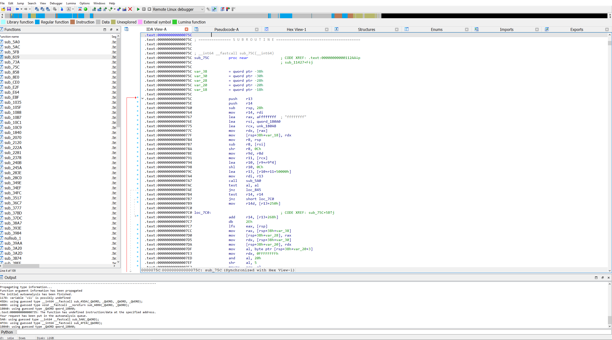
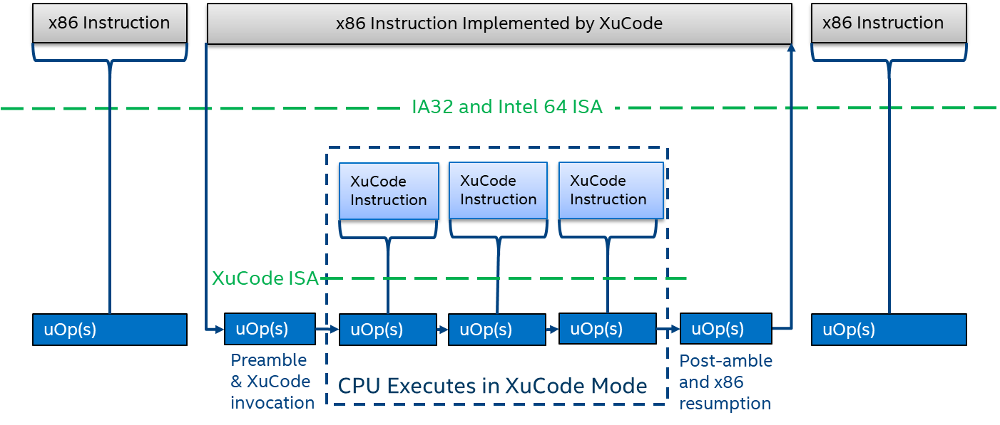

# **Disclaimer**

**All information is provided for educational purposes only. Follow these instructions at your own risk. Neither the authors nor their employer are responsible for any direct or consequential damage or loss arising from any person or organization acting or failing to act on the basis of information contained in this page.**

# Description
At the beginning of 2020, we discovered the Red Unlock technique that allows extracting [Intel Atom Microcode](https://en.wikipedia.org/wiki/Intel_Microcode). We were able to research the internal structure of the microcode and then x86 instruction implementation. Also, we recovered a format of microcode updates, algorithm and the encryption key used to protect the microcode (see [RC4](https://en.wikipedia.org/wiki/RC4)). 

# FAQ
1. Can I make a custom microcode update?

No, you can't. Only decryption is supported, because microcode has an RSA signature for integrity protection. 

2. What kind CPUs are supported?

A microcode update decryption key depends from CPU generation. We've extracted keys for Intel Gemini Lake (Goldmont Plus microarchitecture) and Intel Apolo Lake (Goldmont microarchitecture) generation. See [List of Supported CPUs](#list-of-supported-cpus)

3. How you had extracted the keys?

Using vulnerabilities in Intel TXE we had activated undocumented debugging mode called red unlock and extracted dumps of microcode directly from the CPU. We found the keys and algorithm inside.

4. Where can I find more information about it?

See our talks [Chip Red Pill: How We Achived to Execute Arbitrary Microcode Inside Inttel Atom CPUs](https://www.youtube.com/watch?v=V1nJeV0Uq0M&ab_channel=OffensiveCon) from OffensiveCon22.


# Python
All our scripts are written on Python. We recommend using Python 3. The scripts require pycryptodome packet. To install pycryptodome, run the following command:

```
pip3 install pycryptodome
```

# Decrypting Microcode Update
Run the script **dec_uUpd_Atom_apl.py** for Apolo Lake CPUs:

```
C:\microcode>py -3 dec_uUpd_Atom_apl.py cpu506C9_plat03_ver00000040_2020-02-27_PRD_2FC3D618_.bin
Hash matched at length 0x3E00 (15872)
Data entropy: 6.898306
```


Run the script **dec_uUpd_xu_Atom_glp.py** for Gemini Lake CPUs:

```
C:\microcode>py -3 dec_uUpd_xu_Atom_glp.py cpu706A8_plat01_ver00000018_2020-06-09_PRD_1D9A5DFE.bin
Patch hash matched: enc size: 0x3480
Patch data entropy: 6.438890
XuCode hash matched: size: 0xed40
XuCode data entropy: 7.752765
```


# Unpacking decrypted XuCode (for Goldmont Plus only)

Run the script **XuUnp.py** for Goldmont Plus CPUs:

```
C:\microcode>py -3 XuUnp.py cpu706A8_plat01_ver00000018_2020-06-09_PRD_1D9A5DFE.bin.xu.dec
Processing cpu706A8_plat01_ver00000018_2020-06-09_PRD_1D9A5DFE.bin.xu.dec
. ELF at 0x28
. Parking: 0xD58+944
. XuRT: 0x16EC+D404
. Decompressing 54276 -> 101448, be patient...
+ Unpacked OK
```
  

# About XuCode
XuCode is the software part of SGX technology, there are ELF-files integrated in microcode update.
  


See: [XuCode: An Innovative Technology for Implementing Complex Instruction Flows](https://www.intel.com/content/www/us/en/developer/articles/technical/software-security-guidance/secure-coding/xucode-implementing-complex-instruction-flows.html)


# List of Supported CPUs

The microcode update can be decrypted for following CPUs:

| Processor Model | Microarchitecture | SGX / XuCode support |
| ------ | ------ |  ------ |
| Pentium  J4205 | Goldmont, Apollo Lake | - |
| Celeron  J3455 | Goldmont, Apollo Lake | - |
| Celeron  J3355 | Goldmont, Apollo Lake | - |
| Pentium  N4200 | Goldmont, Apollo Lake | - |
| Celeron  N3450 | Goldmont, Apollo Lake | - |
| Celeron  N3350 | Goldmont, Apollo Lake | - |
| Atom x7  E3940 | Goldmont, Apollo Lake | - |
| Atom x5  E3930 | Goldmont, Apollo Lake | - |
| Atom x7  A3960 | Goldmont, Apollo Lake | - |
| Atom x7  A3950 | Goldmont, Apollo Lake | - |
| Atom x5  A3940 | Goldmont, Apollo Lake | - |
| Atom x5  A3930 | Goldmont, Apollo Lake | - |
| Atom  C3958 | Goldmont, Denverton | - |
| Atom  C3955 | Goldmont, Denverton | - |
| Atom  C3858 | Goldmont, Denverton | - |
| Atom  C3850 | Goldmont, Denverton | - |
| Atom  C3830 | Goldmont, Denverton | - |
| Atom  C3808 | Goldmont, Denverton | - |
| Atom  C3758 | Goldmont, Denverton | - |
| Atom  C3750 | Goldmont, Denverton | - |
| Atom  C3708 | Goldmont, Denverton | - |
| Atom  C3558 | Goldmont, Denverton | - |
| Atom  C3538 | Goldmont, Denverton | - |
| Atom  C3508 | Goldmont, Denverton | - |
| Atom  C3338 | Goldmont, Denverton | - |
| Atom  C3308 | Goldmont, Denverton | - |
| Pentium Silver J5005  | Goldmont Plus, Gemini Lake | + |
| Celeron J4105  | Goldmont Plus, Gemini Lake | + |
| Celeron J4005  | Goldmont Plus, Gemini Lake | + |
| Pentium Silver N5000  | Goldmont Plus, Gemini Lake | + |
| Celeron N4100  | Goldmont Plus, Gemini Lake | + |
| Celeron N4000  | Goldmont Plus, Gemini Lake | + |
| Pentium Silver N5030  | Goldmont Plus, Gemini Lake Refresh | + |
| Celeron N4120  | Goldmont Plus, Gemini Lake Refresh | + |
| Celeron N4020  | Goldmont Plus, Gemini Lake Refresh | + |


# Research Team

Mark Ermolov ([@\_markel___][1])

Maxim Goryachy ([@h0t_max][2])

Dmitry Sklyarov ([@_Dmit][3])


[1]: https://twitter.com/_markel___
[2]: https://twitter.com/h0t_max
[3]: https://twitter.com/_Dmit